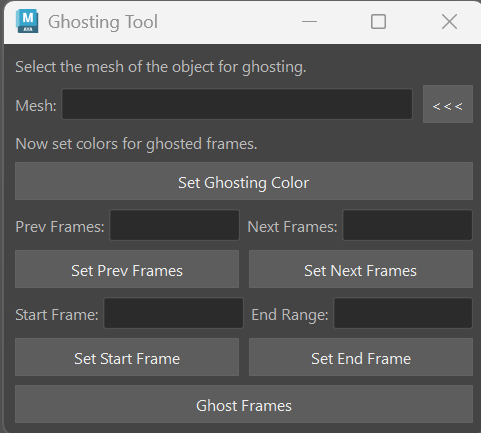
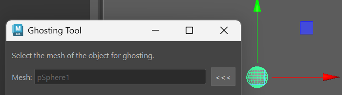
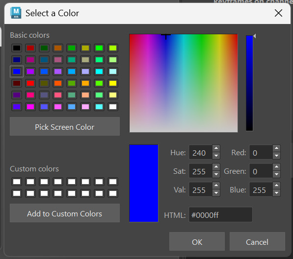
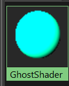
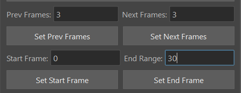
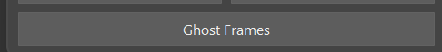
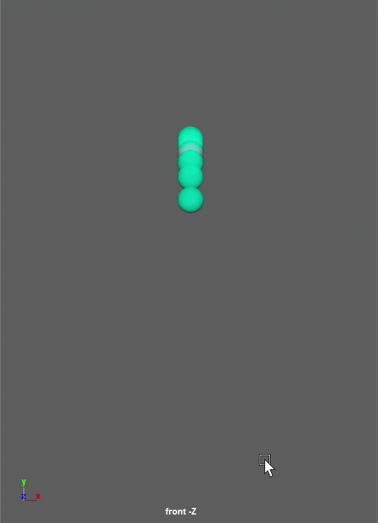

# Maya Ghosting Tool
-------------------------------------------------
## How To Install
Drag *install.mel* into the Maya viewport, and click on the resulting shelf button.

## Tech Stack
|Tool | Version|
|-|-|
|Python|3.12|
|Pyside|6|
|Maya|2025 and above|

-------------------------------------------------

* Creates frame ghosting with selected mesh
* Uses custom color to track silhouettes

------------------------
### Usage

Select mesh in Maya, then press **__<<<__** to set it as the mesh for ghosting.

Press the **Set Ghosting Color** button to open the color dialog.

> This will create a material in Maya that will then be applied to the ghost instances.

Adjust the values for **Prev Frames**, **Next Frames**, **Start Frame**, and **End Frame**. 

> Prev Frames is the amount of frames behind the current that will be ghosted. Next Frames is the amount of frames ahead of the current frame that will be ghosted.

Finally, click on the **Ghost Frames** button to run the tool.

-------

> The frames should now be ghosted properly. If you want to remove the ghosting, simply navigate to the outliner and find the group labeled **__"GhostedFrames_grp"__**, and delete it.
